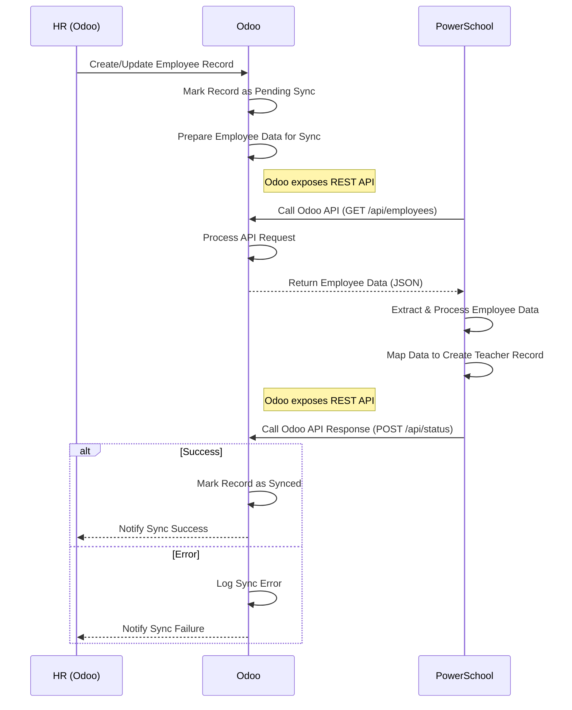

# Odoo will provide the Endpoint using Rest API

## 1. Sync Student/Parent Data from PowerSchool to Odoo

## 2. Sync Employee/Teacher Data from Odoo to PowerSchool

```mermaid
sequenceDiagram
    participant Admin as HR (Odoo)
    participant Odoo as Odoo
    participant PowerSchool as PowerSchool

    Admin->>Odoo: Create/Update Employee Record
    Odoo->>Odoo: Mark Record as Pending Sync
    Odoo->>Odoo: Prepare Employee Data for Sync
    Note right of Odoo: Odoo exposes REST API

    PowerSchool->>Odoo: Call Odoo API (GET /api/employees)
    Odoo->>Odoo: Process API Request
    Odoo-->>PowerSchool: Return Employee Data (JSON)
    
    PowerSchool->>PowerSchool: Extract & Process Employee Data
    PowerSchool->>PowerSchool: Map Data to Create Teacher Record
    Note right of Odoo: Odoo exposes REST API
    PowerSchool->>Odoo: Call Odoo API Response (POST /api/status)

    alt Success
        Odoo->>Odoo: Mark Record as Synced
        Odoo-->>Admin: Notify Sync Success
    else Error
        Odoo->>Odoo: Log Sync Error
        Odoo-->>Admin: Notify Sync Failure
    end
```
