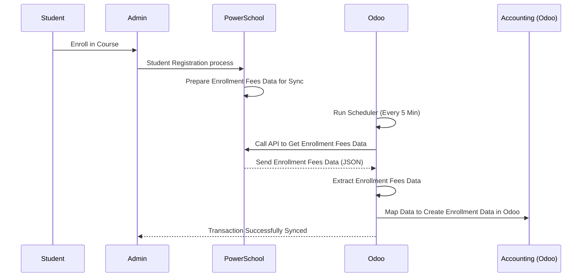

# PowerSchool Provides Rest API

# 1. Sync Student/Parent Data from PowerSchool to Odoo

# 2. Sync Employee/Teacher Data from Odoo to PowerSchool

# 3. Sync Transactional Data (Enrollment Fees) from PowerSchool to Odoo

