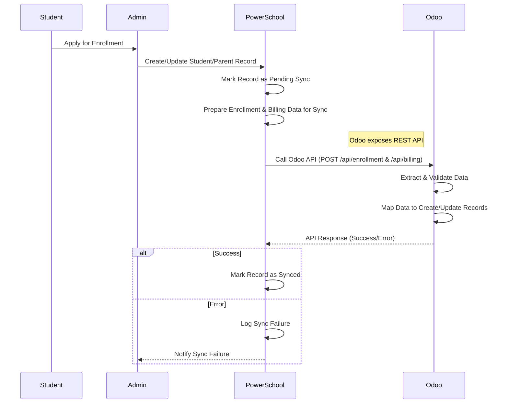

```mermaid
sequenceDiagram
    participant Student as Student
    participant Admin as Admin
    participant PowerSchool as PowerSchool
    participant Odoo as Odoo

    Student->>Admin: Apply for Enrollment
    Admin->>PowerSchool: Create/Update Student/Parent Record
    PowerSchool->>PowerSchool: Mark Record as Pending Sync
    PowerSchool->>PowerSchool: Prepare Enrollment & Billing Data for Sync
    Note left of Odoo: Odoo exposes REST API

    PowerSchool->>Odoo: Call Odoo API (POST /api/enrollment & /api/billing)
    Odoo->>Odoo: Extract & Validate Data
    Odoo->>Odoo: Map Data to Create/Update Records
    Odoo-->>PowerSchool: API Response (Success/Error)

    alt Success
        PowerSchool->>PowerSchool: Mark Record as Synced
    else Error
        PowerSchool->>PowerSchool: Log Sync Failure
        PowerSchool-->>Admin: Notify Sync Failure
    end

```
